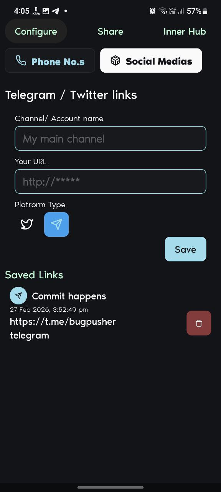
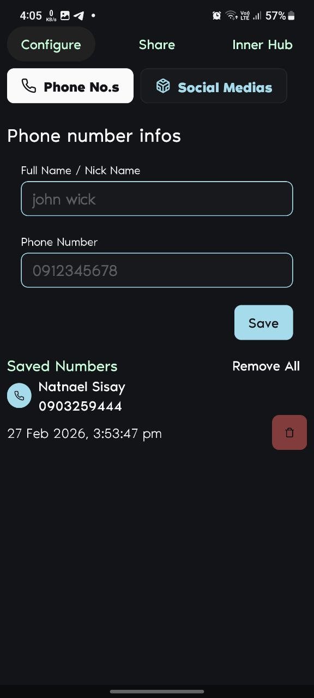
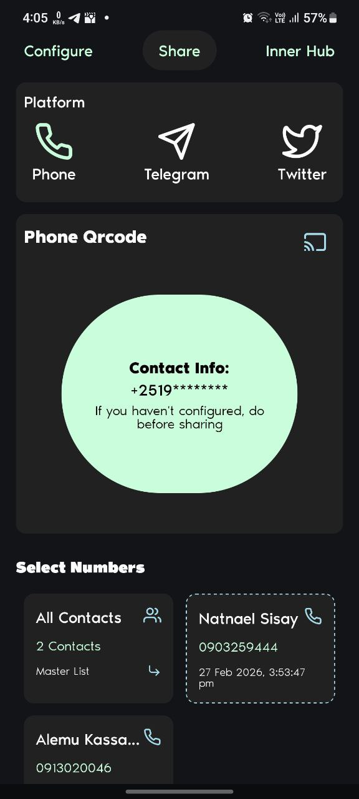
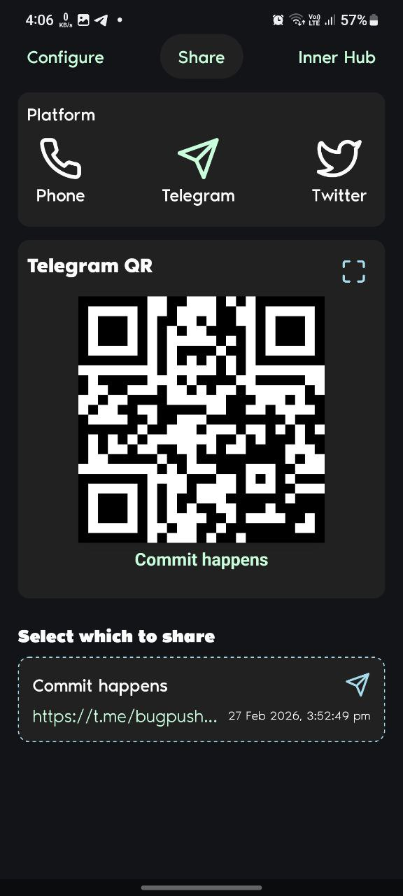

# 📇 Linksy  
### The "Anime-Style" Contact Sharing Mini-App

> "Wait, how do I spell your name again?"  
Never hear this again.

Inspired by those slick contact-sharing scenes in anime, **Linksy** is a mini-app designed to make networking at gatherings, meetups, or parties instant and effortless.

---

## 🚀 The Vibe

Imagine you're at a tech meetup in Addis.  
You meet someone awesome.

Instead of fumbling with your phone or shouting your handle over loud music:

1. Open **Linksy**
2. They open their camera
3. Scan  
4. Done.

⚡ Networking at the speed of light.

---

## 📱 Features

- ⚡ **Instant QR Generation**  
  Converts your contact info into a scannable QR code using the **vCard standard**.

- 🌐 **Social Integration**  
  Share your Telegram, Instagram, GitHub, and more.

- 🌙 **Minimalist UI**  
  Clean, dark-mode friendly design for quick access.

- 📡 **Offline First**  
  No internet required to generate or display your QR code.

---

## 🛠️ Tech Stack

Built for performance and developer experience:

- **Engine:** React Native  
- **Styling:** NativeWind (Tailwind CSS for React Native)  
- **Icons:** Lucide React Native  
- **QR Logic:** react-native-qrcode-svg  

---

## 📸 Demo

<p align="center">
  
  
  
  
  
</p>

---

## 💻 Development & Contribution

Want to explore the code or contribute?

### 1️⃣ Clone the Repository

```bash
git clone https://github.com/Natnsis/Linksy.git
cd Linksy
```

### 2️⃣ Install Dependencies

Install all required project dependencies:

```bash
npm install
# or if you prefer Yarn
yarn install
```
---

### 3️⃣ Run the App on Android

Ensure you have one of the following:

- An Android emulator running  
- A physical Android device connected (USB debugging enabled)

Then run:

```bash
npx react-native run-android
```
